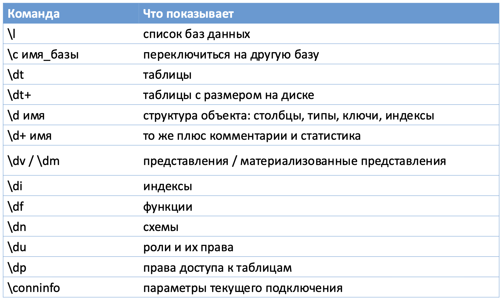
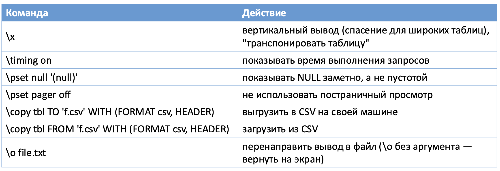
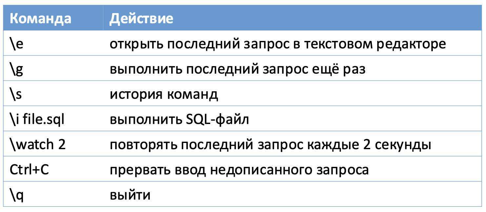

# Базы данных

## Postgres

**1. Запустить контейнер с PostgreSQL:**

```bash
docker compose up -d postgres
```

**2. Подключиться к базе данных:**

```bash
psql -h localhost -p 5432 -U postgres -d appdb
```

| Параметр | Значение    | Описание                          |
| -------- | ----------- | --------------------------------- |
| `-h`     | `localhost` | Хост (проброшенный порт Docker)   |
| `-p`     | `5432`      | Порт PostgreSQL                   |
| `-U`     | `postgres`  | Имя пользователя                  |
| `-d`     | `appdb`     | Имя базы данных                   |

> 💡 Пароль по умолчанию: `postgres`

### Команды






### Связи

